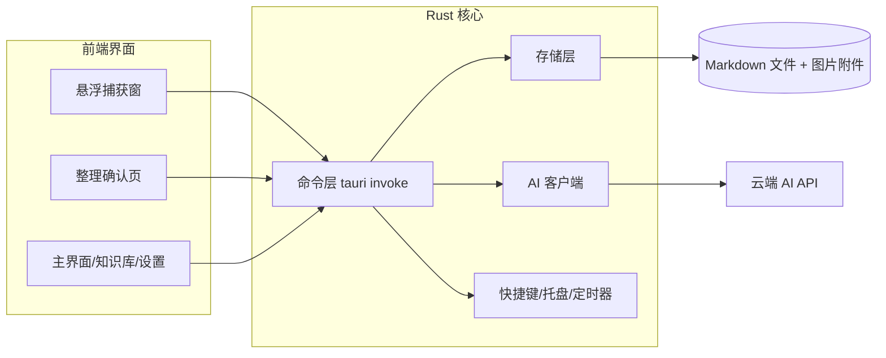

# QuickNote 快速记录软件 — 设计文档

日期：2026-08-08
状态：已与用户逐节确认，待用户审阅

## 1. 背景与目标

现有快速记录类应用存在以下痛点：不够轻量、收费、不能自动整理、富文本支持有限、每次记录需要手动选择文件夹。本产品目标是做一个"零摩擦捕获 + AI 自动整理"的本地优先快速记录软件。

产品定位：个人自用起步，跑通流程后开源发布到 GitHub。

## 2. 核心原则

1. **捕获零摩擦**：全局快捷键呼出悬浮窗，输入即保存，不需要选择文件夹、创建文件。
2. **AI 是秘书，用户是主人**：AI 每晚给出整理建议，用户一键确认或调整；原始记录永不被动修改。
3. **本地优先**：正文、图片、数据库全部存在用户指定的本地数据目录，只有 AI 整理时发送文本。
4. **轻量**：安装包和内存占用保持在一个数量级内（Tauri）。
5. **数据永不锁死**：正文是标准 Markdown 文件，即使数据库损坏也能重建索引恢复。

## 3. 技术栈

- Tauri v2（Rust 核心 + Web 前端）
- 前端：React + TypeScript + Vite，样式 Tailwind CSS
- Markdown 编辑器：Milkdown（所见即所得，支持图片、表格）
- 存储：SQLite（rusqlite）+ Markdown 文件 + 图片附件
- AI：OpenAI 兼容 HTTP 接口（默认 DeepSeek 等），base URL 与模型名可配置；接口抽象，后续可接 Ollama 本地模型

## 4. 架构与模块边界



边界规则：

1. 前端不直接访问文件系统，所有读写通过 Rust 命令层。
2. 存储层是唯一写磁盘的模块。
3. AI 客户端是唯一联网的模块；API 密钥只存本地配置文件。
4. 原始记录不可变：AI 整理结果只写元数据，不修改 .md 正文。

## 5. 存储与数据模型

### 5.1 数据目录

首次启动时由用户选择数据目录（默认建议 `文档/QuickNote`），可放在任意盘符。之后可在设置页修改，修改时提供"迁移数据"（复制 → 校验 → 删除旧目录）。配置文件、数据库、笔记、附件全部在数据目录内，整个目录即全部数据。

```
QuickNote/
├── config.json
├── quicknote.db
├── notes/
│   └── 2026/
│       └── 08/
│           └── 20260808-153012-ab12.md
└── attachments/
    └── 2026/
        └── 08/
            └── 20260808-153012-ab12/
                └── img_001.png
```

### 5.2 文件命名与路径

- 记录 ID 为时间戳格式 `yyyyMMdd-HHmmss-xxxx`（4 位随机后缀），可读、可排序、不撞名。
- 笔记文件按 `notes/年/月/<id>.md` 分层存放，避免单文件夹文件过多；路径可由 ID 直接推导。
- 图片按记录分组存于 `attachments/年/月/<id>/`，Markdown 中以应用根目录相对路径引用（如 `attachments/2026/08/<id>/img_001.png`），渲染时解析为绝对路径。

### 5.3 SQLite 表

| 表 | 作用 |
|---|---|
| `notes` | 记录 ID、创建/更新时间、标题（取首行）、AI 状态、分类、摘要、关键词、标签 |
| `categories` | 分类：名称、来源（内置/AI 提议/用户创建）、启用状态、排序 |
| `suggestions` | AI 建议：建议分类、摘要、关键词、新分类提议、原始 AI 返回、用户确认结果 |
| `daily_summaries` | 每日整理概览（按日期） |

### 5.4 分类体系

- 内置分类：待办、进度、提醒、知识库（知识库有独立页面待遇）。
- 兜底分类："其他"，始终存在、排在最后。
- AI 整理时优先复用现有启用分类；内容不匹配时才提议新分类。
- 新分类需用户在确认页接受后才创建，并加入后续整理的优先列表。
- 有效分类上限 10 个，超出后新内容归入"其他"。
- 用户可在设置中重命名、合并、停用任何分类（包括 AI 创建的）。

## 6. AI 整理流程

### 6.1 触发

- 每晚定时（默认 22:00，可配置）由 Rust 定时器触发。
- 手动"立即整理"按钮随时可跑，用于补跑和失败重试。

### 6.2 处理规则

- 只处理当天、状态为"待整理"的记录；被跳过的记录不再自动重问。
- 发送给 AI 的只有正文文本和图片文件名（`[图片 img_001.png]`），图片内容不出本机。
- 单次请求最多 30 条记录，超出自动分批，保持顺序。

### 6.3 提示词与输出

提示词固定规则：优先复用现有分类、不匹配才提议新分类、总数不超过 10、超出归"其他"。输出严格 JSON：

```json
{
  "notes": [
    {
      "note_id": "20260808-153012-ab12",
      "category": "待办",
      "new_category_proposal": null,
      "summary": "明天下午3点交周报",
      "keywords": ["周报", "明天"]
    }
  ],
  "daily_summary": "今日共3条记录，主要围绕周报和采购"
}
```

Rust 端解析校验；非法 JSON 自动带修复提示重试一次，仍失败则标记"整理失败"，可手动重试。

### 6.4 确认与落地

- 整理页按分类分组展示：原文（可折叠）、建议分类、摘要、关键词。
- 每条可"接受 / 改分类 / 跳过"，顶部有一键"全部接受"。
- 新分类提议以独立卡片标出，接受后创建分类并加入优先列表。
- 接受后仅写入元数据（分类、摘要、关键词），.md 正文不动。
- 每日概览写入 `daily_summaries`。

### 6.5 AI 客户端抽象

定义统一接口，v0.1 实现 OpenAI 兼容 HTTP（DeepSeek/OpenAI/通义等）；Ollama 本地模型后续只需配置 base URL 与模型名即可接入，流程不变。

## 7. 界面交互

### 7.1 悬浮捕获窗（布局 A：底部折叠条）

- 全局快捷键呼出，尺寸约 420×360，置顶、不占任务栏，出现于光标所在屏幕。
- 编辑区占满窗口；底部一条"今日 N 条"横条，点击向上展开今日记录列表。
- 支持 Markdown 所见即所得、剪贴板粘贴/拖拽插入图片。
- 按 Esc 或失焦自动保存并隐藏。
- 托盘常驻图标，可呼出窗口或打开主界面。

### 7.2 主界面（布局 A：左侧边栏）

```
📥 今日速记        ← 原始时间线
✨ 整理建议 (N)    ← 数字角标提示待确认条数
☑ 待办
↗ 进度
⏰ 提醒
📚 知识库          ← 独立空间
其他
⚙ 设置
```

- 分类列表按日期排列，显示首行标题 + AI 摘要 + 关键词。
- "今日速记"是全部新记录的落点，未整理记录始终可回溯。

### 7.3 整理确认页（布局 A：按分类分组）

- 顶部：日期、共 N 条、"全部接受"。
- 按建议分类分组；每条卡片显示时间、原文、摘要、关键词，操作：接受 / 改分类 / 跳过。
- 新分类提议用独立高亮卡片，操作：接受并创建 / 改分类 / 跳过。

### 7.4 知识库（布局 B：列表 + 右侧阅读）

- 左侧标题列表（含搜索框），右侧直接渲染原文全文和图片。
- 关键词、全文搜索；按月份归档浏览。

## 8. 错误处理

| 场景 | 处理 |
|---|---|
| AI 调用失败 | 记录保持待整理，当晚自动重试；界面显示原因 + 立即重试 |
| AI 输出非法 JSON | 自动重试一次（带修复提示），仍失败标记整理失败 |
| 未配置 API key | 定时整理时托盘提醒去设置页，不弹错误窗 |
| 快捷键冲突 | 提示被占用，设置页可更换 |
| 文件写入失败 | 内容不丢，提示保存失败并支持复制内容 |
| 数据库损坏 | 通过 .md 重建索引恢复 |

## 9. 测试策略

- Rust 单元测试：存储层读写、AI JSON 解析、日期与分批逻辑。
- 前端组件测试：捕获窗自动保存、列表折叠、确认页交互。
- AI 流程测试：固定 mock 响应验证解析与容错，不依赖真实网络。
- 手工验收清单：全局快捷键、粘贴图片、Esc 保存、每晚整理闭环、知识库搜索。

## 10. MVP 范围（v0.1）

包含：

- 悬浮捕获窗（底部折叠今日列表）、Markdown 所见即所得、图片粘贴/拖拽
- Esc/失焦自动保存、托盘常驻
- 主界面左侧边栏：今日速记、整理建议、分类列表、知识库、设置
- 首启选择数据目录，设置页可修改并迁移
- 云端 AI（OpenAI 兼容）每晚定时 + 手动整理
- 按分类分组的确认页（接受/改分类/跳过/全部接受）
- 内置 4 类 + "其他"兜底 + AI 提议新分类（上限 10）
- SQLite + .md + 附件存储，重建索引工具

不含（后续版本）：

- 系统级定时提醒通知（提醒仅作为分类）
- 本地模型（接口已预留）
- 多端同步、移动端
- 复杂搜索排序、标签云
- 加密、账户体系

## 11. 后续扩展方向

- 提醒从"识别"升级为"触发"（系统通知、到点弹窗）
- 接入 Ollama 等本地模型
- 知识库的卡片化/链接化（双链）
- 数据导出（Markdown 打包）
